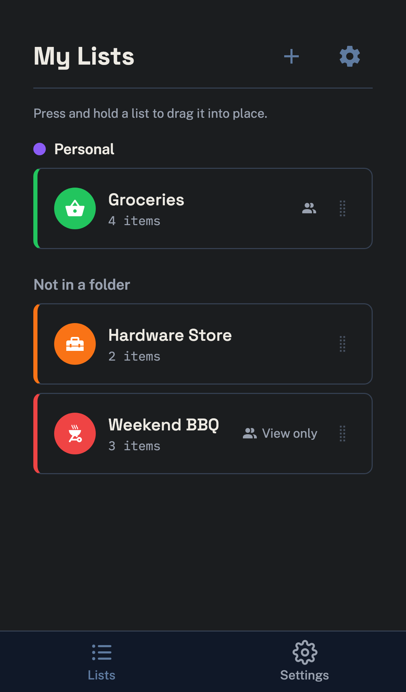
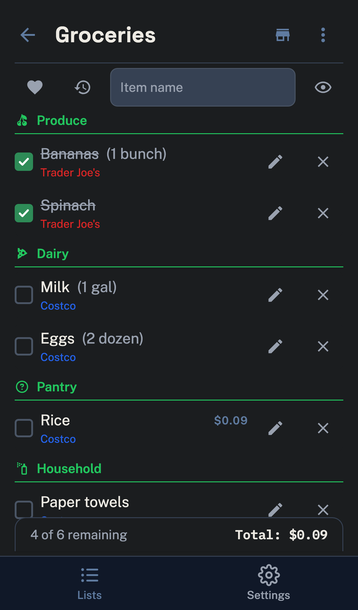
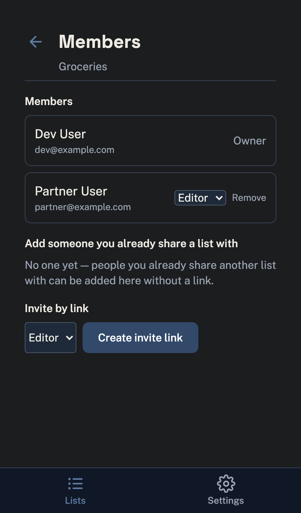
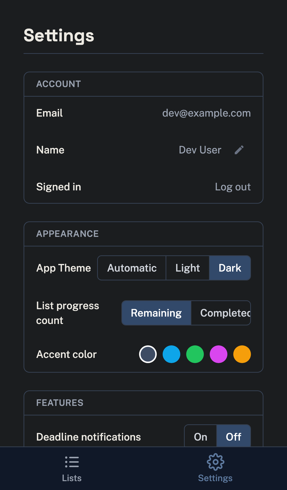

> [!IMPORTANT]
> 📱 **The Android app is in closed beta — [request an invite](https://github.com/brianramseyau/EveryList/issues/new) to try it out.**

<p align="center">
  
</p>

<h1 align="center">EveryList</h1>

<p align="center">
  AnyList meets Google Tasks — one list app for shopping, to-dos, chores, packing, and planning, free and self-hosted with no premium tier.
</p>

<p align="center">
  <a href="https://github.com/brianramseyau/EveryList/pkgs/container/everylist"></a>
  <a href="LICENSE"></a>
  
</p>

---

EveryList is a general-purpose list app: real-time shared shopping lists with aisle-style auto-categorization, plus due dates, recurring items, sub-items, and notes for Google Tasks-style task management — all in the same lists, so one app covers shopping, to-dos, chores, packing lists, and anything else worth tracking and checking off (the EveryList team dogfoods it for its own feature ideas). It's **mobile-first, offline-first, one-tier** — no premium tier, ever — and ships as an installable PWA, native iOS/Android apps, and a desktop app (macOS/Windows/Linux), with voice control through Alexa or Home Assistant. EveryList is feature-complete and self-hostable today; see [`foundational/PLAN_00_FOUNDATIONAL_PLAN.md`](foundational/PLAN_00_FOUNDATIONAL_PLAN.md) for the full product plan, architecture, and decision rationale behind everything below.

## Screenshots

<p align="center">
  
  
  
  
</p>
<p align="center">
  
  
  
  
</p>

## Features

### Lists & items

- **Any kind of list** — unlimited lists for shopping, to-dos, chores, packing, planning, or anything else; quantities, notes, prices with a running budget total, soft-delete with recent-items recovery.
- **Task management** — due dates/times, recurring items (daily/weekly/monthly, specific weekdays, "nth weekday of the month," with an end date/count), and checkable sub-items, so a list can be a Google Tasks-style to-do list as easily as a grocery list.
- **Auto-categorization** — items sort into aisle-style categories (Produce, Dairy, Meat, ...) via keyword matching plus a learned model that remembers each list's explicit category choices (with decay, so stale guesses age out), synced to the device so it keeps working offline, fully customizable per list.
- **Store-aware aisle order** — pick the store you're shopping at and categories reorder to match its real layout; tag items to a store and filter the list down to just that store's items. Store data and aisle order are shared with everyone the list is shared with.
- **Favorites** — go-to items for one-tap re-adding to the list they belong to; scoped per list, since a grocery list and a packing list don't share go-to items.
- **Paste import** — paste a block of text and each line gets parsed and auto-categorized.
- **Folders & badges** — group lists into folders; an uncompleted-item count badges the installed PWA icon (Web Badging API), with per-list exclusion.

### Sync & collaboration

- **Real-time sharing** — SSE-based live updates across everyone on a shared list, with granular `owner`/`editor`/`viewer` roles and join-link invites.
- **Offline-first** — every core interaction works with zero network via a local IndexedDB store and syncs when back online, with last-write-wins conflict resolution.
- **Passcode lock** — a client-side PIN gate on sensitive lists; the server never sees the raw PIN.
- **Print & email export** — a print-friendly stylesheet plus one-click email export of any list.
- **Light/dark/automatic theme + accent palettes** — four accent themes on top of a real, flash-free light/dark/automatic mode.

### Everywhere you are

- **Installable PWA** — add to your home screen on any device, no app store required.
- **Native iOS & Android apps** — the same app wrapped via [Capacitor](https://capacitorjs.com), with a runtime-configurable server URL (point it at your own instance from a `/server-setup` screen, no rebuild needed), pull-to-refresh, and the same offline-first sync as the PWA. Debug-signed/simulator builds are attached to every [GitHub Release](https://github.com/brianramseyau/EveryList/releases) — see [Native apps](#native-apps-iosandroid) below.
- **Android home-screen widget** — a Google-Tasks-style widget (list selector, quick-add `+`, tap-a-row to open, tap-a-checkbox to complete, due date/time display, show/hide-completed) backed by a scoped PAT minted from `Settings → Home-screen widget`.
- **Desktop app (macOS/Windows/Linux)** — an [Electron](https://www.electronjs.org) shell wrapping the same web build, with the same runtime-configurable server URL and offline-first sync as the native apps. Unsigned, "check and link" updates instead of auto-update. See [Desktop app](#desktop-app-electron) below.

### Voice & automation

- **Voice control** — a private [Alexa custom skill](alexa/README.md) (add/remove/complete items, read a list back, plus an on-screen [APL](https://developer.amazon.com/en-US/docs/alexa/alexa-presentation-language/apl-overview.html) visual list on an Echo Show/Hub) and a [Home Assistant HACS integration](https://github.com/brianramseyau/everylist-hass) exposing each list as a native `todo.*` entity for Voice Assist — both authenticate via scoped Personal Access Tokens, not your login.
- **Personal Access Tokens** — scoped, per-list, editor/viewer-capped API tokens (`Settings → Access Tokens`) for third-party integrations like the two above, independent of your login session.

### Self-hosted

- **Single container** — one Docker image, one process, one SQLite file under `/config`; trivial to back up.
- **Automated backups** — configurable daily/weekly/monthly schedule with a chosen time of day and retention window, taken via SQLite's native online backup API so it's safe to run while the app is live; also triggerable on demand from `Settings → Backups`.

Deliberately out of scope: native Watch apps, Siri voice control, and third-party fulfillment integrations (Instacart, etc.) — see the [feature decision matrix](foundational/PLAN_00_FOUNDATIONAL_PLAN.md#3-feature-decision-matrix) in the plan for the full reasoning.

## Tech stack

SvelteKit + Flowbite/Tailwind on the frontend, AdonisJS 6 on the backend, SQLite (single file, no external DB service), Capacitor for the native iOS/Android shells, Electron for desktop. Full breakdown and rationale in [`docs/tech-stack.md`](docs/tech-stack.md).

## Monorepo layout

```
EveryList/
├── apps/
│   ├── android/    # Capacitor native shell
│   ├── api/           # AdonisJS backend
│   ├── desktop/     # Electron desktop shell
│   ├── ios/            # Capacitor native shell
│   └── web/          # SvelteKit PWA
├── packages/
│   └── shared/         # shared TS types, DTOs, validation contracts
├── docker/              # production + dev Dockerfiles, Unraid template
├── docs/                 # detailed reference docs (tech stack, deployment methods, development/)
├── branding/             # app icon source + generated exports, screenshots
├── alexa/                # Alexa custom skill deployment assets (interaction model, account linking)
├── ha-addon/
│   └── everylist/          # Home Assistant Add-on manifest (config.yaml, DOCS.md)
└── foundational/
    └── PLAN_00_FOUNDATIONAL_PLAN.md     # single source of truth for scope & architecture
```

This repo also doubles as a Home Assistant _add-on repository_ — `repository.yaml` at the repo root plus `ha-addon/everylist/` is all Supervisor needs to list EveryList in the Add-on Store; see [Home Assistant](#home-assistant) below.

The Home Assistant HACS integration (a separate thing — a `todo.*` entity client against an existing EveryList server, not a way to run the server itself) lives in its own repo, [`everylist-hass`](https://github.com/brianramseyau/everylist-hass) — separate from this monorepo because HACS requires `custom_components/<domain>/` at the repo root and versions the integration via that repo's own GitHub releases.

## Getting started

### Running the production image

EveryList ships as a single self-contained container — one process serves both the API and the built static frontend on one port:

```bash
docker run -d \
  --name everylist \
  -p 3000:3000 \
  -v /path/to/appdata:/config \
  ghcr.io/brianramseyau/everylist
```

No configuration is required to boot it — an `APP_KEY` is generated on first run and migrations run automatically against the volume. See [`docs/docker.md`](docs/docker.md) for runtime server settings, image tags, and Unraid details.

### Home Assistant

[![Add repository to my Home Assistant][ha-badge]][ha-add-repo]

EveryList is also available as a Home Assistant Add-on, for anyone already running Home Assistant OS/Supervised — same single-container image as the Docker/Unraid path above, no separate `docker run` needed. Click the badge, or add `https://github.com/brianramseyau/EveryList` under **Settings → Add-ons → Add-on Store → repositories** and install "EveryList" from there. See [`ha-addon/everylist/DOCS.md`](ha-addon/everylist/DOCS.md) for the add-on's options.

[ha-badge]: https://my.home-assistant.io/badges/supervisor_add_addon_repository.svg
[ha-add-repo]: https://my.home-assistant.io/redirect/supervisor_add_addon_repository/?repository_url=https%3A%2F%2Fgithub.com%2Fbrianramseyau%2FEveryList

### Native apps (iOS/Android)

Every `vX.Y.Z` tag builds and attaches native app packages — a debug-signed Android APK and an unsigned iOS Simulator build — to the corresponding [GitHub Release](https://github.com/brianramseyau/EveryList/releases), each pointed at your own server via a `/server-setup` screen with no rebuild needed. See [`docs/android-ios.md`](docs/android-ios.md) for signing status and the Android home-screen widget.

### Desktop app (Electron)

Every `vX.Y.Z` tag also attaches unsigned macOS, Windows, and Linux desktop builds to the [GitHub Release](https://github.com/brianramseyau/EveryList/releases) — a client only, pointed at whatever EveryList server you configure on first launch. See [`docs/desktop.md`](docs/desktop.md) for unsigned-build workarounds, update behavior, and the fixed loopback port.

## Voice control & integrations

EveryList lists can be read and edited by voice through two paths, both authenticated by a scoped [Personal Access Token](#personal-access-tokens) rather than your login — mint one from `Settings → Access Tokens`, capped at `editor` role and scoped to only the list(s) you want an integration to reach.

- **Alexa** — a private custom skill for your own household (see [`alexa/README.md`](alexa/README.md) for the full setup, including the Authentik account-linking requirement). "Alexa, ask every list to add milk", "tell every list I got eggs", "what's on my list" — plus an interactive, category-grouped [APL](https://developer.amazon.com/en-US/docs/alexa/alexa-presentation-language/apl-overview.html) visual list on screen devices like an Echo Show or Echo Hub, with tap-to-complete.
- **Home Assistant** — a [HACS](https://hacs.xyz) custom integration ([`everylist-hass`](https://github.com/brianramseyau/everylist-hass)) exposing each list as a native `todo.*` entity, so Voice Assist's built-in add/complete intents work with no custom NLU. Reads, writes, and reorders round-trip live via realtime subscription, with a polling fallback.

### Personal Access Tokens

`Settings → Access Tokens` mints tokens like the ones above by hand, for any other script or integration you want to write against the API — see the self-hosted [API docs](#api-docs) for the full surface. A token can cover multiple lists, is capped below `owner` (never full access), and is revocable at any time with immediate effect — no redeploy needed.

## Development

No external services are required — SQLite runs off a local file, and `pnpm install && pnpm dev` gets both the API and web app running with hot reload. See [`docs/development/environment.md`](docs/development/environment.md) for setup, seed data, useful scripts, and the Docker Compose alternative.

Tests run via `pnpm test` (Japa for the API, Vitest + Playwright for the web app), both gated at 100% coverage in CI. See [`docs/development/testing.md`](docs/development/testing.md) for the full breakdown and CI pipeline.

## API docs

Every instance — including your own self-hosted one — serves its full API reference at `/docs` (a [Scalar](https://scalar.com) UI, vendored so it works offline with no CDN calls), backed by the raw OpenAPI 3.1 document at `/openapi`. Both are unauthenticated. Generated from the Tuyau route registry, so it's always in sync with the actual API.

## Known issues

- **Auth token rehydration race:** deep-linking straight to a route that needs auth (e.g. `/lists/[id]/recently-deleted`) can fire a couple of API calls (`/api/v1/lists`, `/api/v1/folders`) before the bearer token has rehydrated from `localStorage`, causing brief 401s in the console. Not user-visible (the calls that matter retry/succeed once the token is ready), but worth fixing at the root — likely by gating those early fetches on token rehydration completing.

## Contributing

This is a personal project built against [`foundational/PLAN_00_FOUNDATIONAL_PLAN.md`](foundational/PLAN_00_FOUNDATIONAL_PLAN.md) as the single source of truth — any deviation during implementation should be reflected back into that document first. Issues and PRs are welcome.

## License

[MIT](LICENSE) © Brian Ramsey
