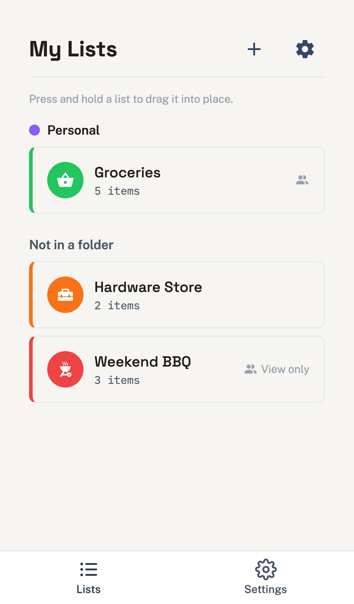
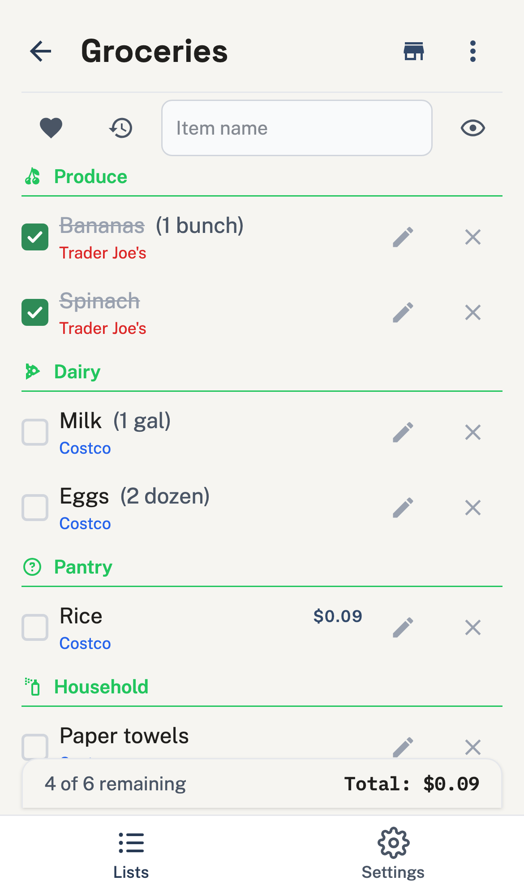
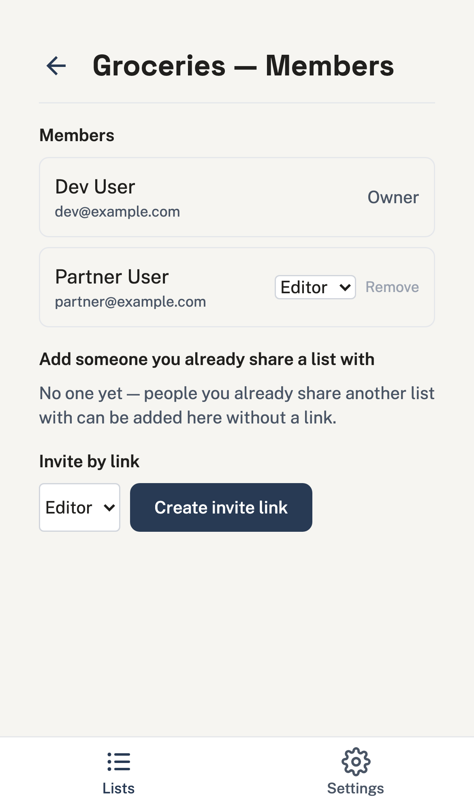
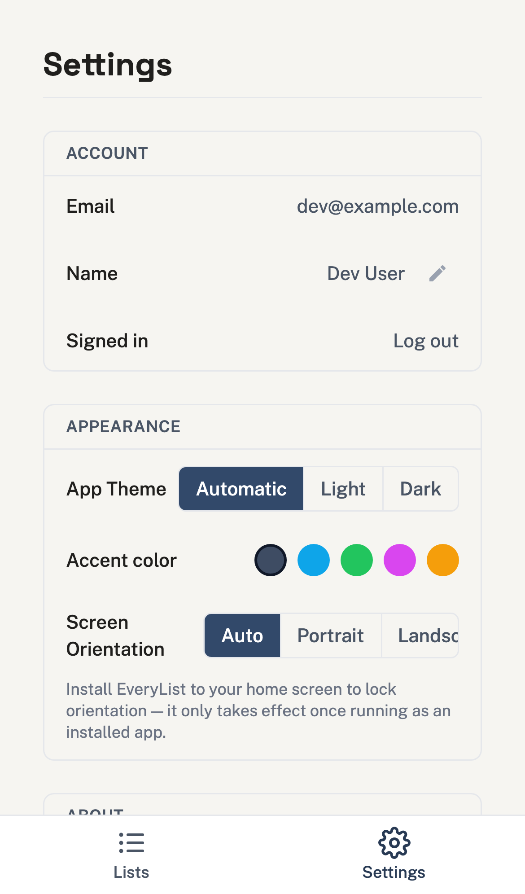

<p align="center">
  
</p>

<h1 align="center">EveryList</h1>

<p align="center">
  A narrower, sharper list app — the 20% of AnyList's feature set that covers 90% of real usage, done well, free, and self-hosted.
</p>

<p align="center">
  <a href="https://github.com/brianramseyau/EveryList/pkgs/container/everylist"></a>
  <a href="LICENSE"></a>
  
</p>

---

<h3 align="center">📱 The Android app is in closed beta</h3>

<p align="center">
  Want an invite to test it out? <a href="https://github.com/brianramseyau/EveryList/issues/new">Open an issue</a> and let us know.
</p>

---

AnyList is broad, cluttered, and paywalls basic usability. EveryList isn't chasing feature parity — it's a **mobile-first, offline-first, one-tier** app that does the everyday list workflow well: create, share in real time, auto-categorize by aisle, check off, and keep working with zero signal. No premium tier, ever. It ships as an installable PWA, as native iOS/Android apps, and as a desktop app (macOS/Windows/Linux), and can be controlled by voice through Alexa or Home Assistant. See [`foundational/PLAN_00_FOUNDATIONAL_PLAN.md`](foundational/PLAN_00_FOUNDATIONAL_PLAN.md) for the full product plan, architecture, and decision rationale behind everything below.

EveryList is feature-complete and self-hostable today.

## Screenshots

<p align="center">
  
  
  
  
</p>

## Features

- **Lists & items** — unlimited lists, quantities, notes, prices with a running budget total, soft-delete with recent-items recovery.
- **Auto-categorization** — items sort into aisle-style categories (Produce, Dairy, Meat, ...) via keyword matching plus a learned model that remembers each list's explicit category choices (with decay, so stale guesses age out), synced to the device so it keeps working offline, fully customizable per list.
- **Store-aware aisle order** — pick the store you're shopping at and categories reorder to match its real layout; tag items to a store and filter the list down to just that store's items. Store data and aisle order are shared with everyone the list is shared with.
- **Favorites** — go-to items for one-tap re-adding to the list they belong to; scoped per list, since a grocery list and a packing list don't share go-to items.
- **Paste import** — paste a block of text and each line gets parsed and auto-categorized.
- **Folders & badges** — group lists into folders; an uncompleted-item count badges the installed PWA icon (Web Badging API), with per-list exclusion.
- **Real-time sharing** — SSE-based live updates across everyone on a shared list, with granular `owner`/`editor`/`viewer` roles and join-link invites.
- **Offline-first** — every core interaction works with zero network via a local IndexedDB store and syncs when back online, with last-write-wins conflict resolution.
- **Passcode lock** — a client-side PIN gate on sensitive lists; the server never sees the raw PIN.
- **Print & email export** — a print-friendly stylesheet plus one-click email export of any list.
- **Light/dark/automatic theme + accent palettes** — four accent themes on top of a real, flash-free light/dark/automatic mode.
- **Installable PWA** — add to your home screen on any device, no app store required.
- **Native iOS & Android apps** — the same app wrapped via [Capacitor](https://capacitorjs.com), with a runtime-configurable server URL (point it at your own instance from a `/server-setup` screen, no rebuild needed), pull-to-refresh, and the same offline-first sync as the PWA. Debug-signed/simulator builds are attached to every [GitHub Release](https://github.com/brianramseyau/EveryList/releases) — see [Native apps](#native-apps-iosandroid) below.
- **Android home-screen widget** — a Google-Tasks-style widget (list selector, quick-add `+`, tap-a-row to open, tap-a-checkbox to complete, show/hide-completed) backed by a scoped PAT minted from `Settings → Home-screen widget`.
- **Desktop app (macOS/Windows/Linux)** — an [Electron](https://www.electronjs.org) shell wrapping the same web build, with the same runtime-configurable server URL and offline-first sync as the native apps. Unsigned, "check and link" updates instead of auto-update. See [Desktop app](#desktop-app-electron) below.
- **Voice control** — a private [Alexa custom skill](alexa/README.md) (add/remove/complete items, read a list back, plus an on-screen [APL](https://developer.amazon.com/en-US/docs/alexa/alexa-presentation-language/apl-overview.html) visual list on an Echo Show/Hub) and a [Home Assistant HACS integration](https://github.com/brianramseyau/everylist-hass) exposing each list as a native `todo.*` entity for Voice Assist — both authenticate via scoped Personal Access Tokens, not your login.
- **Personal Access Tokens** — scoped, per-list, editor/viewer-capped API tokens (`Settings → Access Tokens`) for third-party integrations like the two above, independent of your login session.
- **Self-hosted, single container** — one Docker image, one process, one SQLite file under `/config`; trivial to back up.
- **Automated backups** — configurable daily/weekly/monthly schedule with a chosen time of day and retention window, taken via SQLite's native online backup API so it's safe to run while the app is live; also triggerable on demand from `Settings → Backups`.

Deliberately out of scope: native Watch apps, Siri voice control, and third-party fulfillment integrations (Instacart, etc.) — see the [feature decision matrix](foundational/PLAN_00_FOUNDATIONAL_PLAN.md#3-feature-decision-matrix) in the plan for the full reasoning.

## Tech stack

| Layer | Choice |
|---|---|
| Frontend | [SvelteKit](https://kit.svelte.dev) (Svelte 5, static adapter) + [Flowbite Svelte](https://flowbite-svelte.com) + Tailwind CSS |
| PWA | [vite-plugin-pwa](https://vite-pwa-org.netlify.app) (Workbox) + [Dexie.js](https://dexie.org) offline store |
| Backend | [AdonisJS 6](https://adonisjs.com) — Lucid ORM, VineJS validation, Transmit (SSE) |
| Database | SQLite 3 (WAL) via `better-sqlite3` — single file, no external DB service |
| Shared types | `packages/shared` — DTOs/contracts shared between API and web |
| Testing | Japa + c8 (backend), Vitest + Testing Library + Playwright (frontend) — 100% coverage policy on unit/integration |
| Deployment | Single Docker image, LinuxServer.io-style (`s6-overlay`, `PUID`/`PGID`), published to GHCR |
| Native shell | [Capacitor](https://capacitorjs.com) (iOS + Android) — wraps the same SvelteKit build, no separate native codebase |

Full rationale for each choice is in [§4 of the plan](foundational/PLAN_00_FOUNDATIONAL_PLAN.md#4-technology-stack).

## Monorepo layout

```
EveryList/
├── apps/
│   ├── android/    # Capacitor native shell
│   ├── api/           # AdonisJS backend
│   ├── desktop/     # Electron desktop shell
│   ├── ios/            # Capacitor native shell
│   └── web/          # SvelteKit PWA
├── packages/
│   └── shared/         # shared TS types, DTOs, validation contracts
├── docker/              # production + dev Dockerfiles, Unraid template
├── branding/             # app icon source + generated exports, screenshots
├── alexa/                # Alexa custom skill deployment assets (interaction model, account linking)
└── foundational/
    └── PLAN_00_FOUNDATIONAL_PLAN.md     # single source of truth for scope & architecture
```

The Home Assistant HACS integration lives in its own repo, [`everylist-hass`](https://github.com/brianramseyau/everylist-hass) — separate from this monorepo because HACS requires `custom_components/<domain>/` at the repo root and versions the integration via that repo's own GitHub releases.

## Getting started

### Requirements

- Node.js **24.20.0** (see `.nvmrc`)
- [pnpm](https://pnpm.io) 10.x (`corepack enable` will pick up the pinned version)

### Local development

No external services (database, cache, etc.) are required — SQLite runs off a local file.

```bash
git clone https://github.com/brianramseyau/EveryList.git
cd EveryList
pnpm install
cp apps/api/.env.example apps/api/.env
pnpm db:setup

pnpm dev
```

`pnpm db:setup` creates `apps/api/tmp/db.sqlite3`, runs all migrations, and seeds dev sample data (users, lists, stores, categories, items) — required once per fresh clone (or whenever you wipe `apps/api/tmp/`) before the API has any tables to query. The sample data is idempotent and only seeds when `NODE_ENV=development`, so it's safe to re-run any time the db gets reset. Log in with `dev@example.com` / `password` (or `partner@example.com` / `password` to see the shared-list side) — see [`apps/api/database/seeders/dev_seeder.ts`](apps/api/database/seeders/dev_seeder.ts) for what's included.

This runs both the API (`http://localhost:3334`) and the web app (`http://localhost:5174`) in parallel with hot reload. Before starting, a pre-flight check (`scripts/dev-preflight.mjs`) verifies both ports are free and aborts with the offending process(es) if something else — e.g. a stale dev server from another project — is already listening.

Other useful scripts, runnable from the repo root across every workspace:

```bash
pnpm build         # build all apps
pnpm lint          # ESLint across the monorepo
pnpm typecheck     # tsc --noEmit in every workspace
pnpm test          # Japa (api) + Vitest (web)
pnpm format        # Prettier write

pnpm db:migrate         # run pending migrations
pnpm db:migrate:status  # show migration status
pnpm db:migrate:rollback# roll back the last migration batch
pnpm db:seed            # run seeders (dev sample data)
pnpm db:reset           # drop all tables, re-migrate, and re-seed
```

### Local development via Docker Compose

```bash
cp apps/api/.env.example apps/api/.env
docker compose up
```

Runs the API and web app as separate containers with the repo bind-mounted for live editing.

### Running the production image

EveryList ships as a single self-contained container — one process serves both the API and the built static frontend on one port. No configuration is required to boot it:

```bash
docker run -d \
  --name everylist \
  -p 3000:3000 \
  -v /path/to/appdata:/config \
  ghcr.io/brianramseyau/everylist
```

`PUID`/`PGID` default to `99`/`100` (Unraid's `nobody`/`users`) and can be overridden; an `APP_KEY` is generated on first boot and persisted to `/config/app_key` if you don't supply one; database migrations run automatically against `/config/everylist.sqlite3` on every start, so a fresh volume and version upgrades both just work. An [Unraid Community Applications template](docker/unraid-template.xml) is included.

Available image tags:

| Tag | Meaning |
|---|---|
| `nightly` | Latest build off `main` — bleeding edge, no stability guarantee |
| `vX.Y.Z` | Exact release, never moves |
| `vX` | Latest release within major version `X` |
| `latest` | Latest stable release |

### Native apps (iOS/Android)

Every `vX.Y.Z` tag also builds and attaches native app packages to the corresponding [GitHub Release](https://github.com/brianramseyau/EveryList/releases): a debug-signed Android APK (sideload-ready as-is) and an unsigned iOS Simulator build. Neither is store-signed yet — there's no release keystore or Apple Developer Program enrollment behind this build — so today this is a "build it yourself a real release, or sideload/simulate the CI one" situation, not an App/Play Store listing. The app itself doesn't care: on first launch it sends you to a `/server-setup` screen to enter your own instance's URL, so one build works against anyone's self-hosted server with no rebuild.

The Android build also ships a **home-screen widget** (see [Features](#features)): set it up once from `Settings → Home-screen widget` (which mints a scoped token just for the widget), then place it from your launcher's widget picker. It's network-backed against your instance (a native widget can't reach the WebView's offline cache), showing the last fetched snapshot with a "can't reach server" note when offline.

### Desktop app (Electron)

Every `vX.Y.Z` tag also attaches macOS (Intel + Apple Silicon), Windows, and Linux desktop builds to the [GitHub Release](https://github.com/brianramseyau/EveryList/releases). Like the iOS/Android apps, this is **a client, not a bundled deployment** — it never runs the API, opens a database, or runs migrations. It loads the exact same web build as everyone else, served from a local loopback HTTP server, and points it at whatever EveryList server you configure on first launch via `/server-setup`.

- **Requires a server running this release or later** — the desktop app needs a CORS entry (`apps/api/config/cors.ts`) that predates-it servers don't have. If login fails immediately with no more specific error, upgrade your server first.
- **Builds are unsigned.** There's no Apple Developer Program membership or Authenticode certificate behind this project.
  - **macOS**: Gatekeeper blocks the downloaded `.dmg` with "EveryList is damaged and can't be opened." Right-click the app → **Open**, or run `xattr -dr com.apple.quarantine /Applications/EveryList.app`.
  - **Windows**: SmartScreen will warn on the unsigned installer — click "More info" → "Run anyway."
- **Updates are "check and link," not automatic.** Settings → About has a "Check" button that compares your version against the latest GitHub Release and links to the download if one exists — there's no in-place auto-updater (an unsigned macOS build can't use one at all). Updating means downloading the new installer and reinstalling; nothing is lost, since your data lives on the server and the local offline cache rebuilds from it. If you have unsynced offline changes queued, reconnect once before updating so they flush first.
- **The loopback port is fixed** (default `41783`), not randomized — it's part of the app's stored origin, alongside your server URL, login token, and offline cache. Overriding it (via a `config.json` file in the app's data directory, `{ "port": 41784 }`) resets all of those; only do it if the default port is actually unavailable on your machine.

## Voice control & integrations

EveryList lists can be read and edited by voice through two paths, both authenticated by a scoped [Personal Access Token](#personal-access-tokens) rather than your login — mint one from `Settings → Access Tokens`, capped at `editor` role and scoped to only the list(s) you want an integration to reach.

- **Alexa** — a private custom skill for your own household (see [`alexa/README.md`](alexa/README.md) for the full setup, including the Authentik account-linking requirement). "Alexa, ask every list to add milk", "tell every list I got eggs", "what's on my list" — plus an interactive, category-grouped [APL](https://developer.amazon.com/en-US/docs/alexa/alexa-presentation-language/apl-overview.html) visual list on screen devices like an Echo Show or Echo Hub, with tap-to-complete.
- **Home Assistant** — a [HACS](https://hacs.xyz) custom integration ([`everylist-hass`](https://github.com/brianramseyau/everylist-hass)) exposing each list as a native `todo.*` entity, so Voice Assist's built-in add/complete intents work with no custom NLU. Reads, writes, and reorders round-trip live via realtime subscription, with a polling fallback.

### Personal Access Tokens

`Settings → Access Tokens` mints tokens like the ones above by hand, for any other script or integration you want to write against the API — see the self-hosted [API docs](#api-docs) for the full surface. A token can cover multiple lists, is capped below `owner` (never full access), and is revocable at any time with immediate effect — no redeploy needed.

## Testing

- **Backend:** `pnpm --filter @everylist/api test` (Japa, with `c8` coverage gated at 100%)
- **Frontend:** `pnpm --filter @everylist/web test` (Vitest + Testing Library, 100% coverage gate; Playwright for E2E)

CI (GitHub Actions) runs lint → typecheck → tests/coverage → Docker build → E2E smoke on every PR; see [`.github/workflows`](.github/workflows).

Full architecture, scope decisions, and the AnyList feature-by-feature decision matrix live in [`foundational/PLAN_00_FOUNDATIONAL_PLAN.md`](foundational/PLAN_00_FOUNDATIONAL_PLAN.md).

## API docs

Every instance — including your own self-hosted one — serves its full API reference at `/docs` (a [Scalar](https://scalar.com) UI, vendored so it works offline with no CDN calls), backed by the raw OpenAPI 3.1 document at `/openapi`. Both are unauthenticated. Generated from the Tuyau route registry, so it's always in sync with the actual API.

## Known issues

- **Auth token rehydration race:** deep-linking straight to a route that needs auth (e.g. `/lists/[id]/recently-deleted`) can fire a couple of API calls (`/api/v1/lists`, `/api/v1/folders`) before the bearer token has rehydrated from `localStorage`, causing brief 401s in the console. Not user-visible (the calls that matter retry/succeed once the token is ready), but worth fixing at the root — likely by gating those early fetches on token rehydration completing.

## Contributing

This is a personal project built against [`foundational/PLAN_00_FOUNDATIONAL_PLAN.md`](foundational/PLAN_00_FOUNDATIONAL_PLAN.md) as the single source of truth — any deviation during implementation should be reflected back into that document first. Issues and PRs are welcome.

## License

[MIT](LICENSE) © Brian Ramsey
